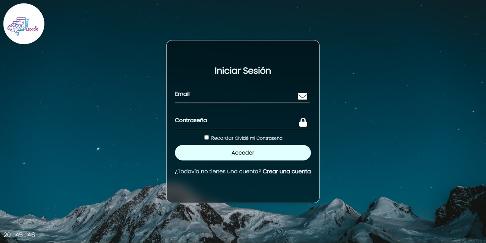
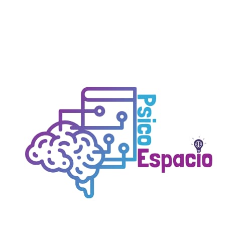

# Login and Register

El proyecto PsicoEspacio es una aplicación web diseñada para brindar a los usuarios una plataforma segura y amigable donde puedan acceder a servicios relacionados con la salud mental y el bienestar emocional. Nuestra aplicación ofrece funciones de inicio de sesión y registro para los usuarios, proporcionando un espacio seguro para interactuar con profesionales de la salud mental, acceder a recursos educativos y llevar un registro de su progreso en su viaje hacia el bienestar.

Funcionalidades Principales
Inicio de Sesión y Registro: Los usuarios pueden crear una cuenta o iniciar sesión en la plataforma para acceder a los servicios personalizados.

Interacción con Profesionales: PsicoEspacio facilita la comunicación entre usuarios y profesionales de la salud mental, lo que permite consultas en línea, chat y seguimiento de tratamientos.

Recursos Educativos: La aplicación ofrece una amplia gama de recursos educativos, incluyendo artículos, videos y ejercicios para el crecimiento personal.

Registro de Progreso: Los usuarios pueden realizar un seguimiento de su progreso en su viaje hacia el bienestar, estableciendo metas y registrando sus logros.

## Capturas de Pantalla

